```python
def bin2dec(x):
    x = str(x)
    a = 0
    for i in range(2, len(x)):
        a += int(x[i]) * 2 ** (-i + 1)
    return a
```


```python
from sympy import *
import numpy as np
```


```python
def n_degree_taylor(formula, x, x_0, n):
    '''
    Given the analytic expression, x and x_0, calculate
    its nth degree Taylor polynomial
    Note: Variable is defaulted to x
    '''
    var_x = Symbol('x')
    acc = 0
    # Be careful, n+1 because it's up to n
    for i in range(n+1):
        acc += diff(formula, var_x, i).subs(var_x, x_0)/factorial(i)*(x-x_0)**i
    return float(acc)
```


```python
def n_degree_taylor_derivative(formula, x, x_0, n, n_d):
    '''
    Given the analytic expression, x and x_0, calculate
    its n_d-th derivative based on n-th degree Taylor polynomial
    Note: Variable is defaulted to x
    
    Parameters:
    formula -- analytic expression in sympy
    x -- desired point
    x_0 -- expansion point
    n -- highest degree of polynomial
    n_d -- degree of derivative

    Returns:
    n_d-th derivative based on n-th degree Taylor polynomial
    '''
    var_x = Symbol('x')
    acc = 0
    # Be careful, n+1 because it's up to n
    for i in range(n+1):
        acc += diff(formula, var_x, i).subs(var_x, x_0)/factorial(i)*(var_x-x_0)**i
    derivative = diff(acc, var_x, n_d)
    return derivative.subs(var_x, x)
```


```python
def decimal_to_floating_point(x, n, p):
    """
    Convert a positive decimal number x into its normalized floating-point
    form.
    
    Parameters
    ----------
    x: float
        Input positive decimal number
    n: int
        Number of binary bits in fraction
    p: int
        Exponent range

    Returns
    -------
    f: str
        String of length n representing the fraction part of x in the given floating-point system
    m: int
        Exponent of x in the given floating-point system
    """

    # your implementation goes here

    integer_part = int(x)
    decimal_part = x - integer_part
    int_bin = bin(integer_part)[2:]

    def dec2bin(x):
        x -= int(x)
        bins = []

        while x:
            x *= 2
            bins.append(1 if x>=1. else 0)
            x -= int(x)

        return bins
    decimal_bins = dec2bin(decimal_part)
    if integer_part != 0:
        m = len(str(int_bin)) - 1
        f = str(int_bin)[1:]
        for i in decimal_bins:
            f += str(i)
        if len(f) > n:
            f = f[:n]
        elif len(f) < n:
            f += (n - len(f)) * '0'

    if integer_part == 0:
        m = -(decimal_bins.index(1) + 1)
        f = ''
        for i in range(decimal_bins.index(1) + 1, len(decimal_bins)):
            f += str(decimal_bins[i])
        if len(f) > n:
            f = f[:n]
        elif len(f) < n:
            f += (n - len(f)) * '0'

    return f, m
```

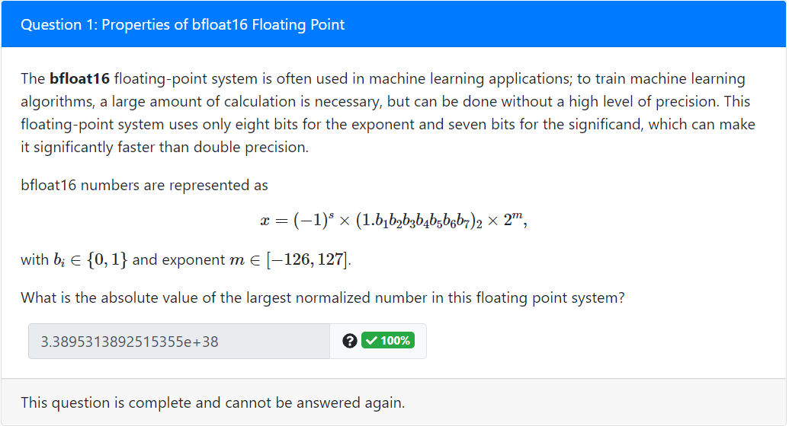


```python
# Properties of bfloat16 Floating Point
n = 7
m = 127
x = "0." + 7 * "1"
(1+bin2dec(x))*2**m
```


    3.3895313892515355e+38


```python
x = Symbol('x')
a = series(3 - 6 * x + 8 * x**2, x, x0 = 3, n = 3)
print(a)

f = lambdify(x, a)
print(a.evalf(subs = {x : 3}))
f(3)
```

    42*x + 8*(x - 3)**2 - 69
    57.0000000000000
    


    57


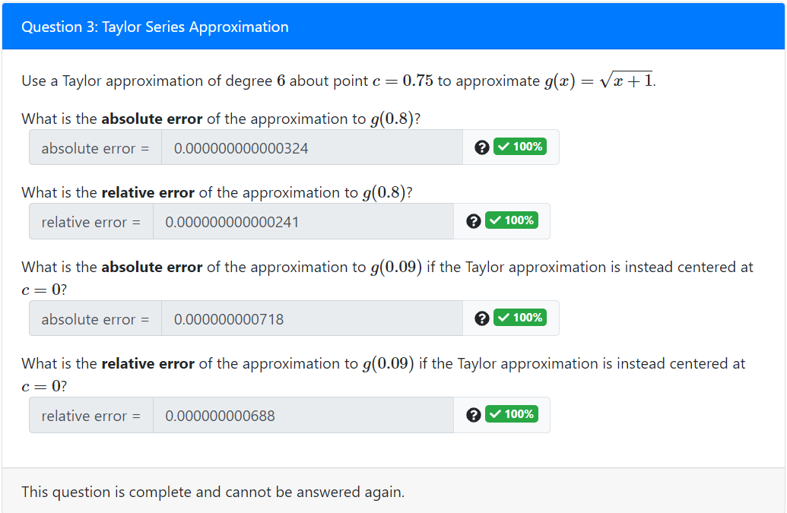


```python
g = lambda x: np.sqrt(x+1)
g1approx = n_degree_taylor(sqrt(x+1),0.8, 0.75, 6)
abs_error1 = abs(g1approx -g(0.8))

rel_error1 = abs_error1/g(0.8)
g2approx = n_degree_taylor(sqrt(x+1),0.09,0,6)
abs_error2 = abs(g2approx - g(0.09))
rel_error2 = abs_error2/g(0.09)
print(abs_error1, rel_error1, abs_error2, rel_error2)
```

    3.2374103398069565e-13 2.413023196956349e-13 7.182632266733435e-10 6.879713982154864e-10
    


```python
f, m = decimal_to_floating_point(28.75, 6,100)
(1 + bin2dec('0.1101'))*2**m-28.75
```


    0.25


```python
(157.27 - 1.5727)/100
1.5570
```


    1.5569730000000002


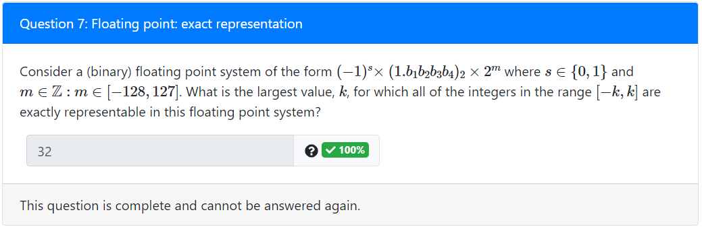


```python
# exact representation
(1+bin2dec('0.1111'))*2**4
n = 4
2**(n+1)
```


    32


```python
from sympy import *
x = Symbol('x')
taylor = 0
a = 1/(x+1)
for i in range(4):
    taylor+=a.evalf(subs= {x:0.35}) / factorial(i) * (0.9 - 0.35) ** i
    a = diff(a)
true = 1 / (0.9 + 1)
err_035_3 = abs((true - taylor)/true)
```

    0.0275496245114698
    


```python
order = 3
f0 = 1
df0 = 1
d2f0 = 1
h = 2
x = Symbol('x')
t = f0 + df0 * x + d2f0 /2 *x **2
I_approx = integrate(t, (x, -h/2, h/2))
abs(I_approx)
```


$\displaystyle 2.33333333333333$


```python
Integrate = lambda x : f0 * x + df0 * x**2 / 2 + d2f0 /6 * x**3
Integrate(1) - Integrate(-1)
```


    2.3333333333333335


```python
a = 1
k = 0
sum = a + 10 ** k
while a != sum:
    k -= 1
    sum = a+10**k
k += 1
```


    -16


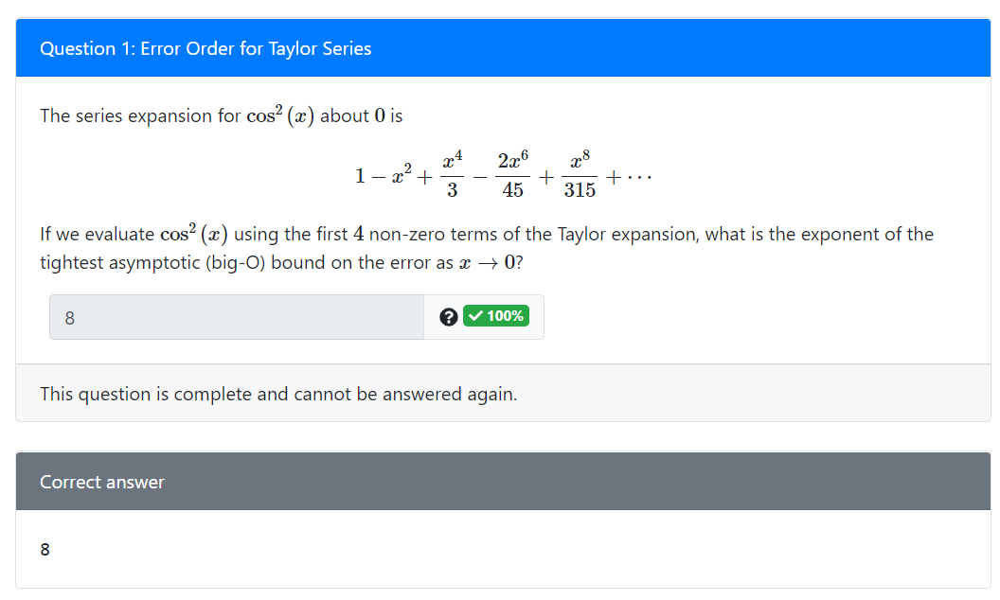

The answer should be the order of the next term that not includes in the approximation.

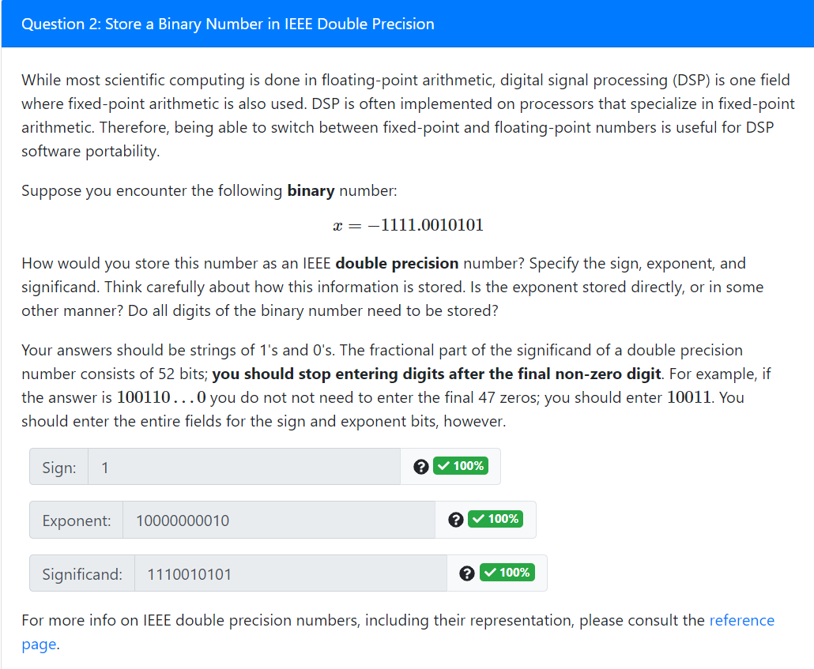


```python
exponent = bin(3 + 1023)[2:]
exponent
```


    '10000000010'


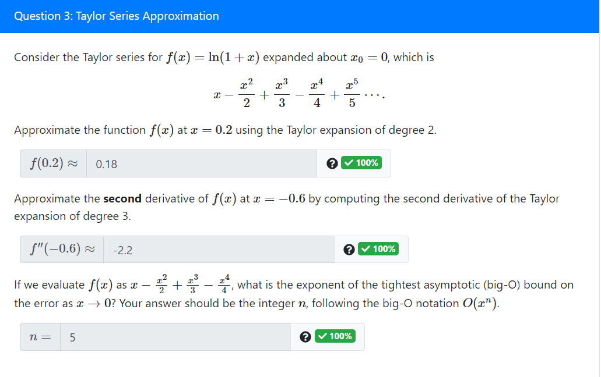


```python
print(n_degree_taylor(log(1+x), 0.2, 0, 2))
print(n_degree_taylor_derivative(log(1+x), -0.6, 0, 3, 2))
4 + 1
```

    0.18
    -2.20000000000000
    


    5


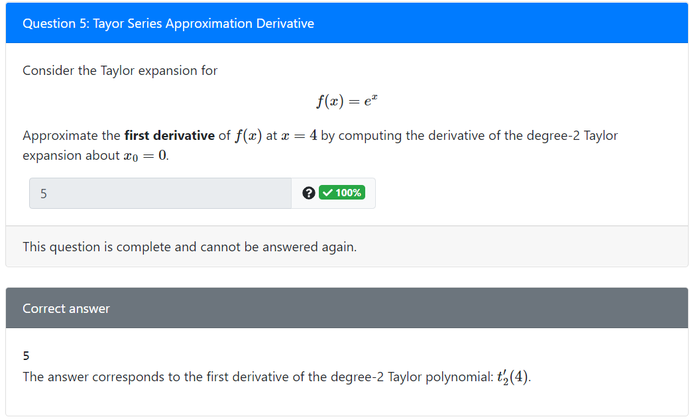


```python
n_degree_taylor_derivative(exp(x), 4, 0, 2, 1)
```


$\displaystyle 5$


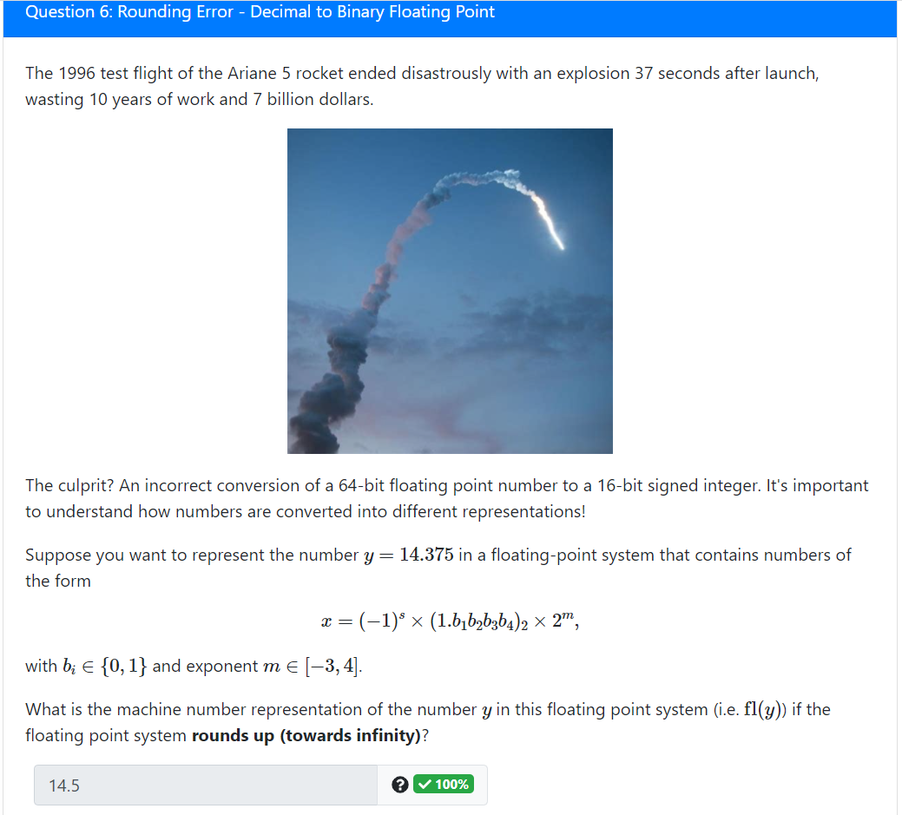


```python
f, m = decimal_to_floating_point(14.375, 10,100)
print(f,m)
(1+bin2dec('0.1101'))*2**m
```

    1100110000 3
    


    14.5


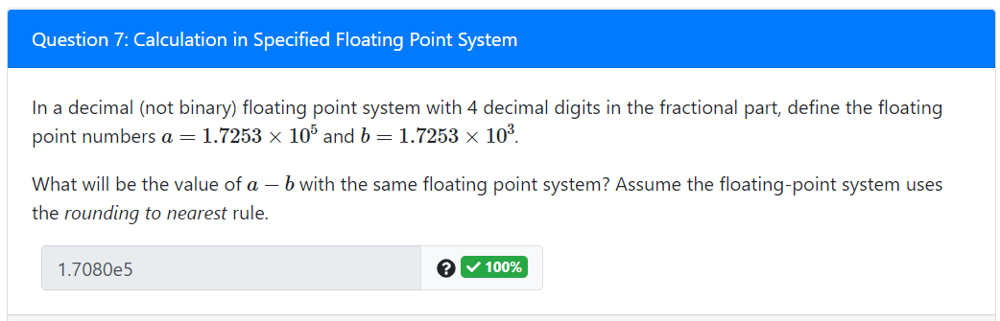


```python
(1.7253e5-1.7253e3)/1e5 # Then round
```


    1.708047


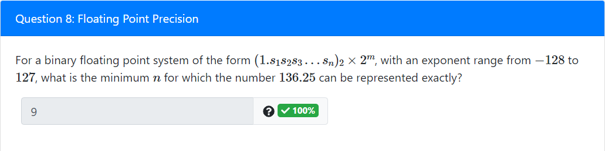


```python
f, m = decimal_to_floating_point(136.25, 100, 100)
i = -1
while f[i] == '0':
    i -= 1

100 + i + 1
```


    9


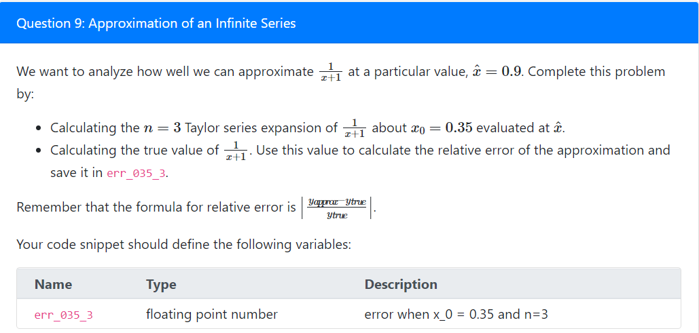


```python
from sympy import *

def n_degree_taylor(formula, x, x_0, n):
    '''
    Given the analytic expression, x and x_0, calculate
    its nth degree Taylor polynomial
    Note: Variable is defaulted to x
    '''
    var_x = Symbol('x')
    acc = 0
    # Be careful, n+1 because it's up to n
    for i in range(n+1):
        acc += diff(formula, var_x, i).subs(var_x, x_0)/factorial(i)*(x-x_0)**i
    return float(acc)

x = Symbol('x')
approx = n_degree_taylor(1/(1+x),0.9,0.35,3)
true = 1/(0.9+1)
err_035_3 = abs((approx - true) / true)
#err_035_3
```


    0.02754962451146962


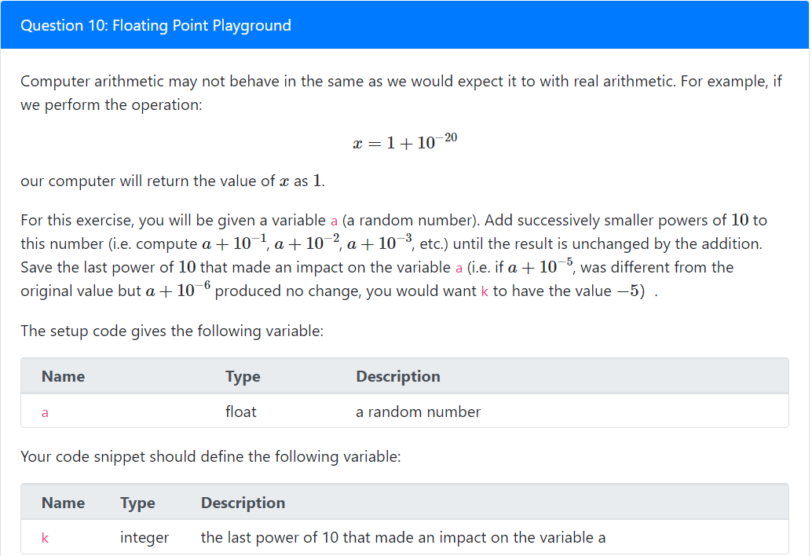


```python
k = 0
sum = a + 10 ** k
while sum != a:
    k -= 1
    sum = a + 10 ** k
k = k + 1
```

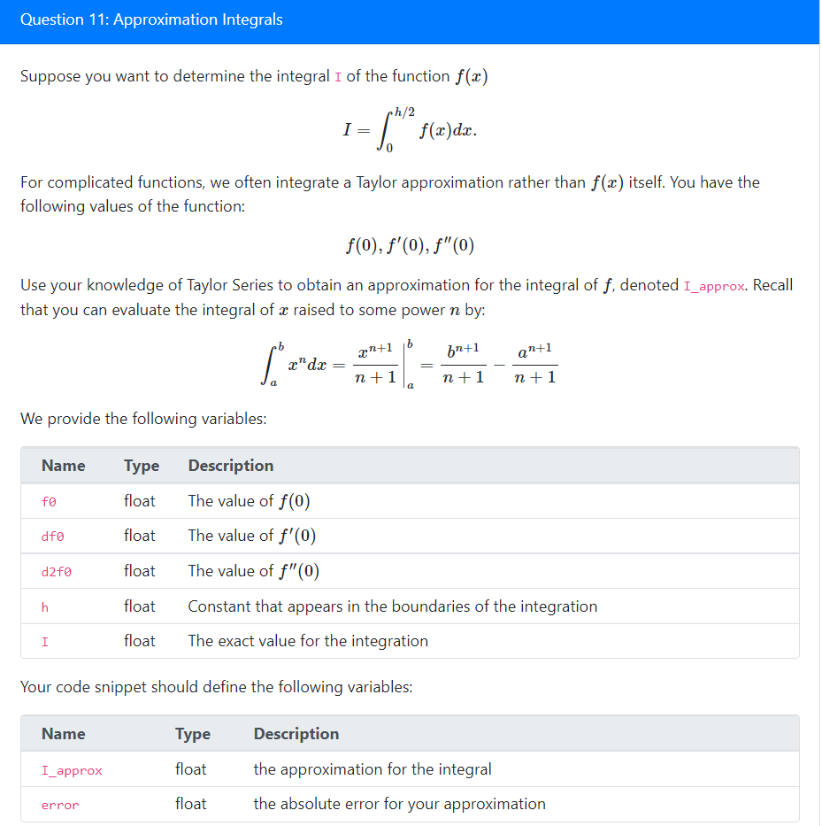


```python
#f = lambda x : f0 + df0 * x + d2f0 * x**2/2
integration = lambda x: f0*x + df0 *x**2/2 + d2f0*x**3/6
I_approx = integration(h/2) - integration(0)
error = abs(I_approx-I)
```
